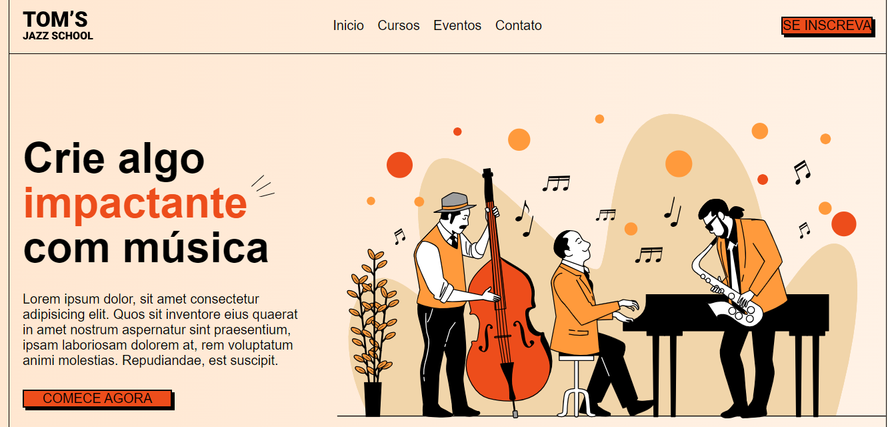

<h1 align="center">Landing page</h1>

Landing page elaborada atraves dos aprendizados na aulas da onebitcode.

  <a href="#-tecnologias">Tecnologias</a>&nbsp;&nbsp;&nbsp;|&nbsp;&nbsp;&nbsp;
  <a href="#-projetos">Projetos</a>&nbsp;&nbsp;&nbsp;|&nbsp;&nbsp;&nbsp;
  <a href="#memo-licença">Licença</a>

  

 

## 🚀 Tecnologias 

- HTML e CSS
- Git e Github 

## 💻 Projeto

A ideia do projeto era elaborar uma landing page que exibisse alguns links, imagens e treinasse os conhecimentos em CSS e HTML.

- [Acesse aqui o projeto online](https://klebsonamarantes.github.io/landing-page-tom-jazz-school/)

## :memo: Licença

Esse projeto está sob a licença MIT.

